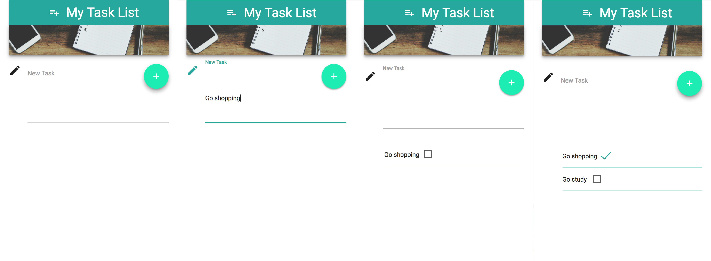

# Assignment 01

**TODO List**

**Due Date: Week 7 - Midnight of 3/8/2017**

## Assignment Specification

Develop a ToDo List that allows users to manage tasks.
* It should allow the user to create, read(diplay), edit and delete tasks.
* Pick and use a standard library for CSS styling. My recommendation is [Materialize CSS](http://materializecss.com/)
* Your designs **must** be [responsive](https://developers.google.com/web/tools/chrome-devtools/device-mode/emulate-mobile-viewports)
* Take care of proper positioning of the UI elements
* **BONUS POINTS** for custom animated elements
* You do not need to save the tasks yet. We'll cover that in class later

## Resources
* Bootcamp Simple to do list
* [Materialize CSS](http://materializecss.com/)

